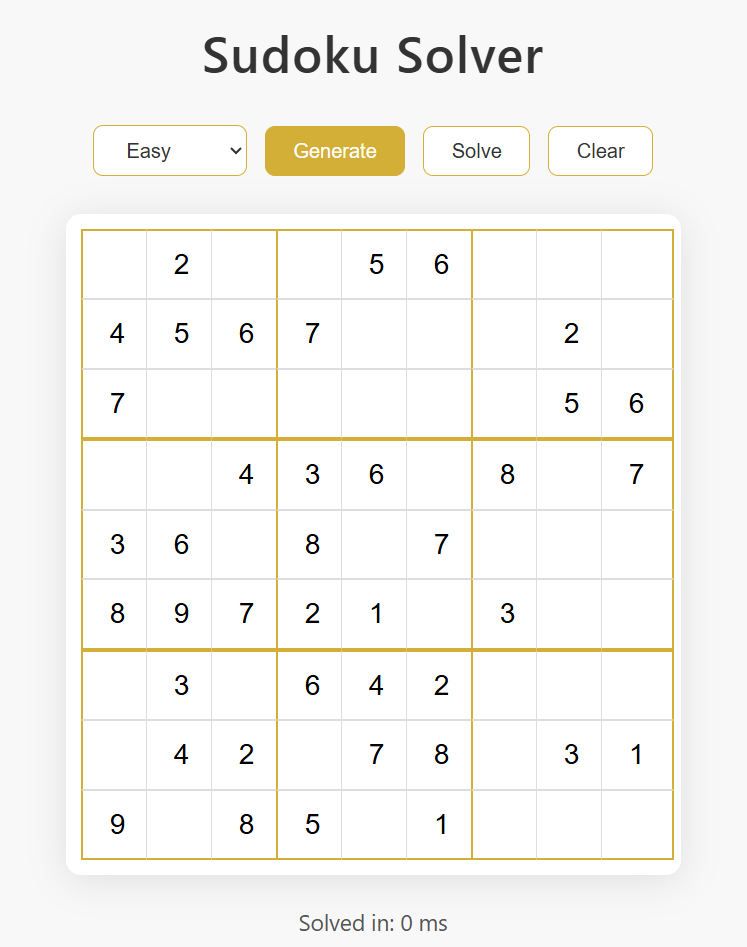
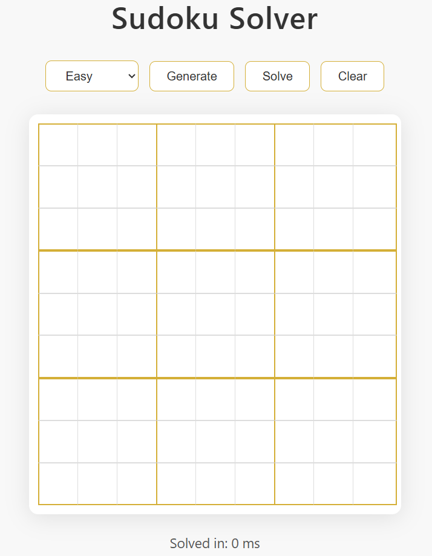

# 🧩 Sudoku Solver — Spring Boot + HTML/CSS/JS

A clean, elegant, fast Sudoku Solver web application built using **Java Spring Boot** (backend) and **HTML/CSS/JS** (frontend).

This project includes:
- Sudoku puzzle generator (Easy / Medium / Hard)
- Sudoku solver using backtracking
- Beautiful premium white–gold UI
- Live solve timer (in seconds)
- Input validation (only 1–9 allowed)
- Auto-move between cells
- Shake animation for invalid input

---

## ⭐ Screenshots (UI Preview)

### 🔸 Generated Puzzle  

### 🔸 Empty Board  

---

## 🚀 Features

### ✔ Sudoku Generator  
- Auto-generates puzzles in three difficulty levels  
- Clean number layout  

### ✔ Sudoku Solver  
- Efficient Java backtracking algorithm  
- Solves almost instantly  
- Timer shows solve time in **seconds**

### ✔ Premium UI  
- Minimal white & gold design  
- Smooth hover effects  
- Elegant 3×3 grid borders  
- Auto-focus next cell  
- Invalid input shake animation

### ✔ Input Validation  
- Only digits **1–9** allowed  
- No letters, symbols, or 0  
- Improves user experience

---

## 🛠 Tech Stack

### **Backend**
- Java 17  
- Spring Boot 3.5.7  
- Maven  

### **Frontend**
- HTML5  
- CSS3 (custom premium theme)  
- Vanilla JavaScript  

---

## 📂 Project Structure

Sudoku_Solver/
└── solver/
├── src/
│ └── main/
│ ├── java/com/sudoku/solver/
│ │ ├── SudokuSolverApplication.java
│ │ ├── controller/
│ │ └── service/
│ └── resources/
│ ├── static/
│ │ ├── index.html
│ │ ├── style.css
│ │ └── script.js
│ └── application.properties
├── pom.xml
└── run_sudoku.bat

---

## ▶️ How to Run the Project

### **1️⃣ Option A — Using VS Code Terminal**

cd solver
.\mvnw.cmd spring-boot:run

Backend starts on:

👉 **http://localhost:9090**

Open it in the browser.

---

### **2️⃣ Option B — Using Auto-Start Launcher (.bat)**

Double-click:

run_sudoku.bat

This will:

✔ Start backend  
✔ Auto-open browser  
✔ Load Sudoku UI  

No commands needed.

---

## 🔗 API Endpoints

### **POST** `/solve`  
Solves the given 9×9 board.

### **GET** `/generate/{difficulty}`  
Generates a new puzzle.  
Difficulty = `easy`, `medium`, `hard`.

---

## ⏱️ Timer Format

Solve time is shown in:

Solved in: 0.08 s

Time is calculated accurately using JavaScript’s high-resolution clock.

---

## 🚧 Future Enhancements

- Highlight row & column of active cell  
- Highlight conflicting numbers  
- Dark/Light mode toggle  
- Mobile responsive layout  
- Step-by-step solve animation  
- Undo/Redo  
- Save puzzle state  
- Puzzle sharing link  

---

## 👤 Author

Bushireddy Sathwik Reddy

---

## ⭐ If you like this project  
Give the repository a ⭐ on GitHub!
